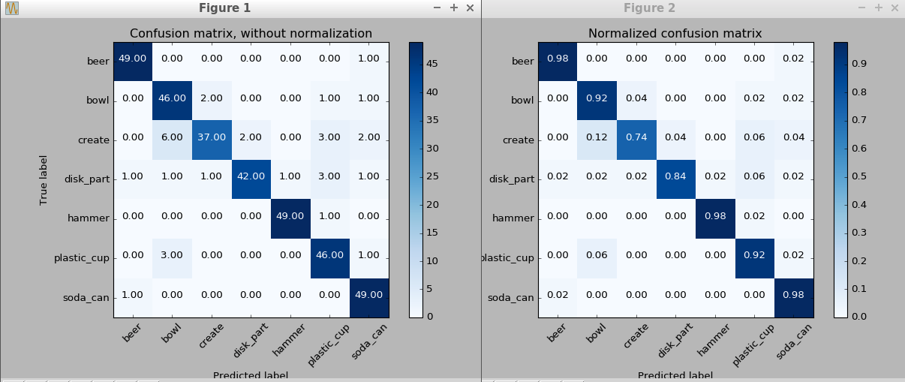
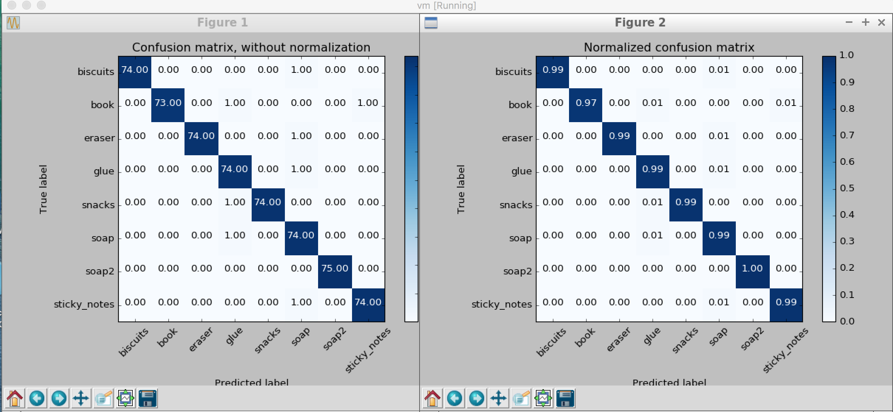

## Project: Perception Pick & Place

---
### James Covino Writeup 

#### 1. Provide a Writeup / README that includes all the rubric points and how you addressed each one.  You can submit your writeup as markdown or pdf.  

### Exercise 1, 2 and 3 pipeline implemented
#### 1. Completed Exercise 1 steps. Pipeline for filtering and RANSAC plane fitting implemented.
Followed the tutorial.
#### 2. Completed Exercise 2 steps: Pipeline including clustering for segmentation implemented.  
Followed the tutorial.
#### 2. Completed Exercise 3 Steps.  Features extracted and SVM trained.  Object recognition implemented.
Followed the tutorial. I Had troubles with the Sklearn package. The code written by Udacity was not compatible with the recent version of SKlearn. Initially, I tried to change the code to fit with the updates, but decided a pip install to an older version was more efficient. 

Trained model results from training excerise, below.

Trained model results from Project, below.  Notice improvements to object calls. This was accomplished by increasing the iterations in the for loop in the capture features script.

### Pick and Place Setup

#### 1. For all three tabletop setups (`test*.world`), perform object recognition, then read in respective pick list (`pick_list_*.yaml`). Next construct the messages that would comprise a valid `PickPlace` request output them to `.yaml` format.

The 3 yaml file were generated for worlds 1,2, and 3. 

World-1 was successful with 3/3:
* biscuits
* soap
* soap2

World 2 was successful with 5/5:
* biscuits
* soap
* book
* soap2
* glue

World 3 was succesful with 7/8:
* book
* snacks
* biscuits
* soap2
* soap
* glue
* X missed eraser X

### Discussion
Despite the project being primarly written by Udacity, I had trouble getting through it. There were multiple hurdles from errors in transferring Udacity's code and compatibility issues with Sklearn.  Once I had the trained model in place with excellent accuracy and precision, I knew I was close. However, some final tweaking was required.

Note- I used the following github to troubleshoot my code, especially the pr2_mover(object_list) function found in project_template.py :   https://github.com/chriswernst/Perception-Udacity-RoboticsND-Project3

Changes that resulted in a succesful submision included:
* y and z axis passthrough filtering
* values that work for segmenting objects
    ec.set_ClusterTolerance(0.02)  
    ec.set_MinClusterSize(100)
    ec.set_MaxClusterSize(3000)

* Take into account that all the objects may not be detected in World 3.
	The code below handled the situation, see * sections. If an object from the pick list was detected, then it was processed.
	~~~~
    object_centroid_dict = {}  #*
    detected_name_list = []
    for object in object_list:
        points_arr = ros_to_pcl(object.cloud).to_array()
        object_centroid_dict[object.label] = np.mean(points_arr, axis=0)[:3]  #*
        detected_name_list.append(object.label) 

    dict_list = []
    object_list_param = rospy.get_param('/object_list')
    
    for i in range(0, len(object_list_param)):
        object_name.data = object_list_param[i]['name']
        item_name= object_list_param[i]['name']

        if item_name in detected_name_list: #*
            print item_name
            try:
                pick_pose.position.x = np.asscalar(object_centroid_dict[item_name][0])
                pick_pose.position.y = np.asscalar(object_centroid_dict[item_name][1])
                pick_pose.position.z = np.asscalar(object_centroid_dict[item_name][2])
            except ValueError:
                continue

	~~~~

